<div align="center">


# Aigram

A self-hosted web client for your own Telegram account, with an AI layer built in.

[](https://github.com/Sina-Amare/Aigram/actions/workflows/quality.yml)
[](LICENSE)
[](https://www.python.org/downloads/)
[](#install-it-on-your-phone)

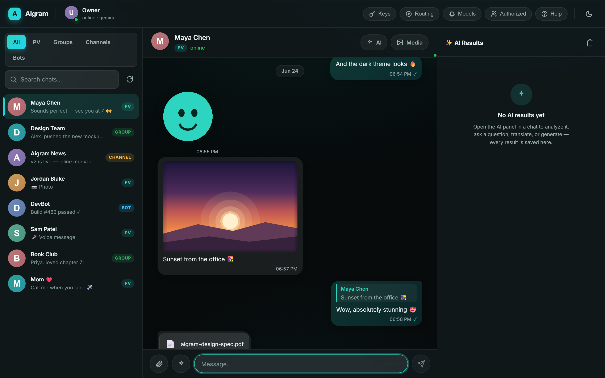

</div>

Aigram signs into your personal Telegram account and puts a web interface in front of it. You can read and send messages with inline media, and you can run AI actions on a conversation — summarize it, ask questions about its history, translate it, generate an image, or turn a voice note into text — without leaving the chat. AI output lands in the panel first, so nothing is sent under your name unless you choose to send it.

Everything runs on hardware you control. Your Telegram session and your API keys stay on your own machine; there is no hosted service in between. The panel installs as a Progressive Web App, so it behaves like a native app on a phone as well as in the browser.

> Aigram started as a project called SakaiBot. The Python package, the `sakaibot` CLI, and the Docker service still use that name.

## Contents

- [Screenshots](#screenshots)
- [Features](#features)
- [Quick start](#quick-start)
- [Configuration](#configuration)
- [AI commands](#ai-commands)
- [Architecture](#architecture)
- [Development](#development)
- [Deployment](#deployment)
- [Contributing](#contributing)
- [Security and disclaimer](#security-and-disclaimer)
- [License](#license)

## Screenshots

<p align="center">
  
</p>

<table>
<tr>
<td width="50%" align="center">
  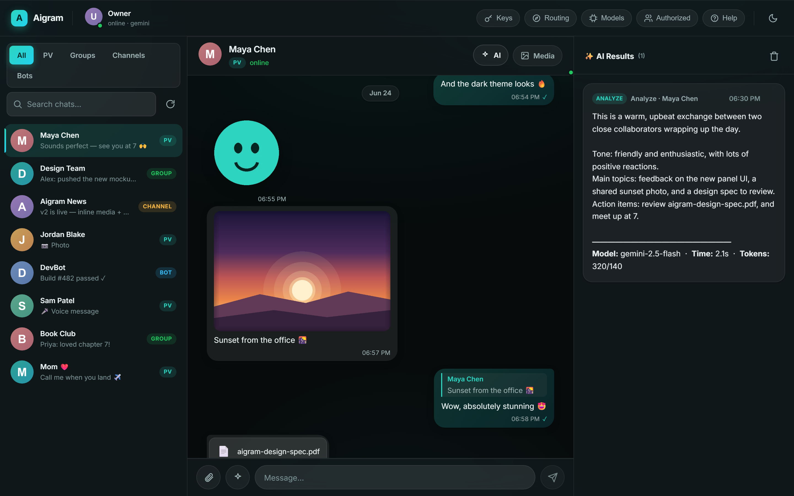<br/>
  <sub>AI runs inside the chat — results land in a categorized, saved history</sub>
</td>
<td width="50%" align="center">
  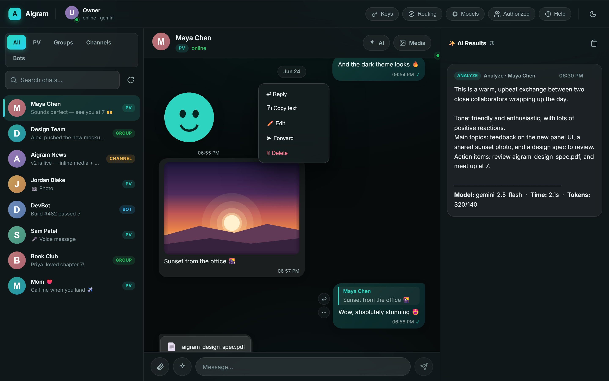<br/>
  <sub>Reply, copy, edit, forward, delete — the primary Telegram actions</sub>
</td>
</tr>
<tr>
<td width="50%" align="center">
  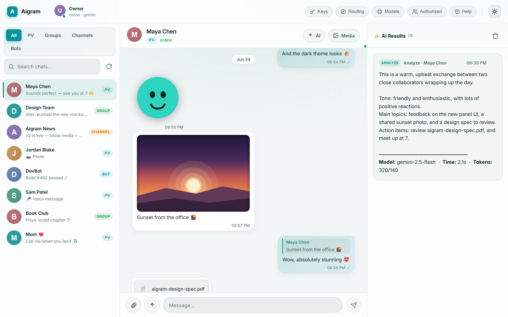<br/>
  <sub>Light theme, with real dark/light parity</sub>
</td>
<td width="50%" align="center">
  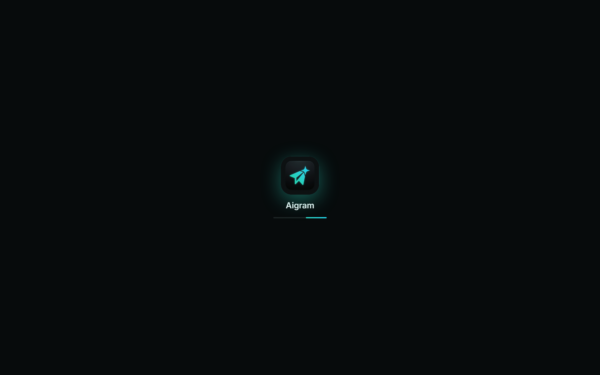<br/>
  <sub>A branded launch screen on PWA and web</sub>
</td>
</tr>
</table>

<details>
<summary><b>More screenshots</b> — mobile, live typing, attachments, profile, providers</summary>

<table>
<tr>
<td width="50%" align="center">
  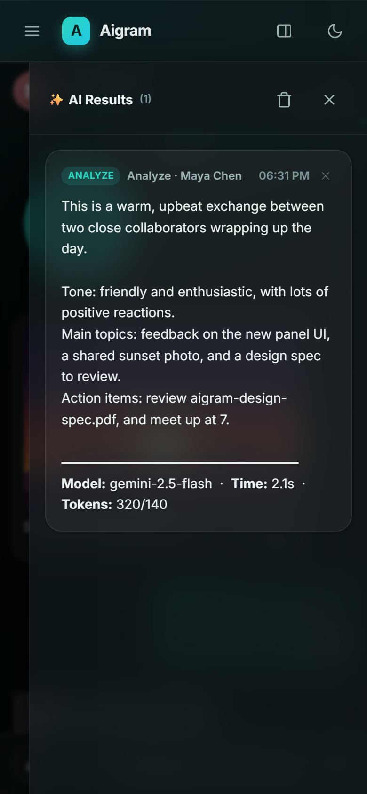<br/>
  <sub>On a phone, AI results land in a categorized history drawer</sub>
</td>
<td width="50%" align="center">
  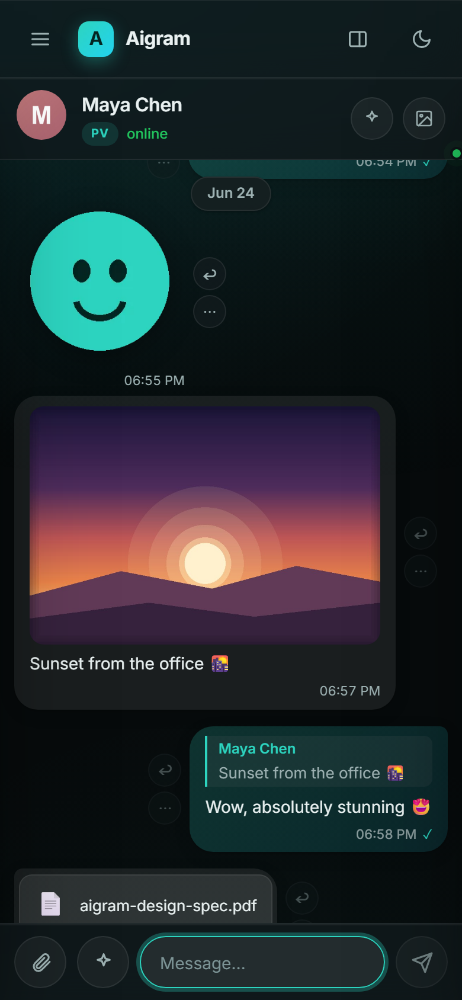<br/>
  <sub>The same client on a phone, installable as a PWA</sub>
</td>
</tr>
<tr>
<td width="50%" align="center">
  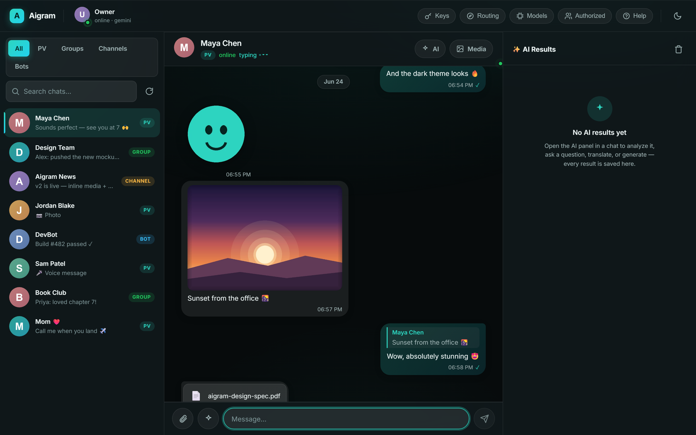<br/>
  <sub>Live typing, presence, and instant messages over SSE</sub>
</td>
<td width="50%" align="center">
  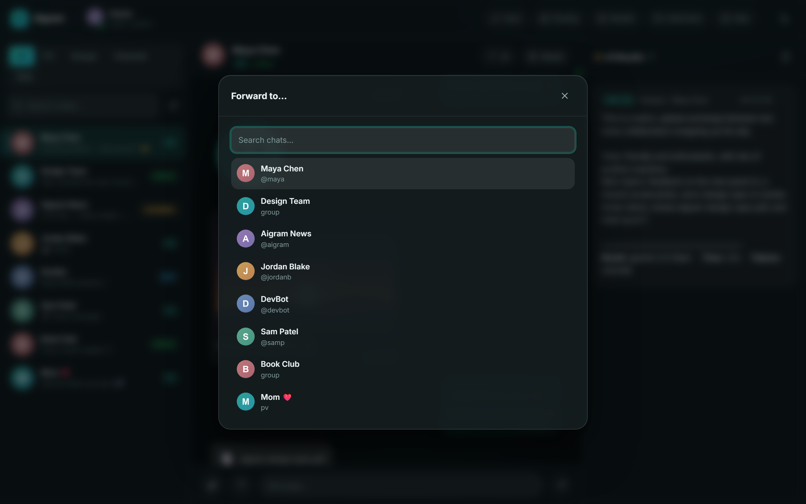<br/>
  <sub>Forward to any chat from a searchable picker</sub>
</td>
</tr>
<tr>
<td width="50%" align="center">
  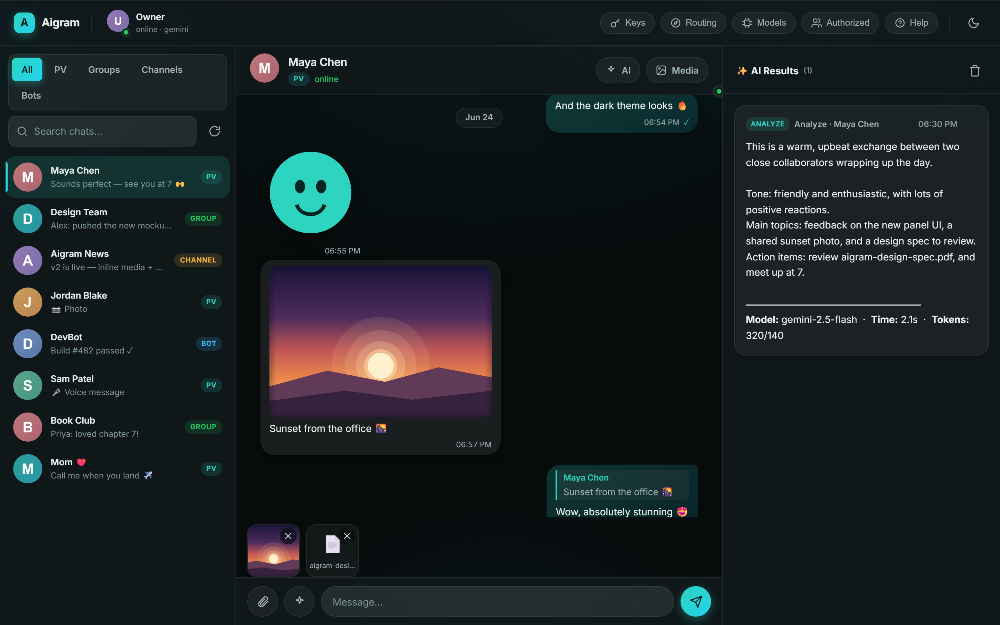<br/>
  <sub>Attach files and images (button or paste) with a preview strip</sub>
</td>
<td width="50%" align="center">
  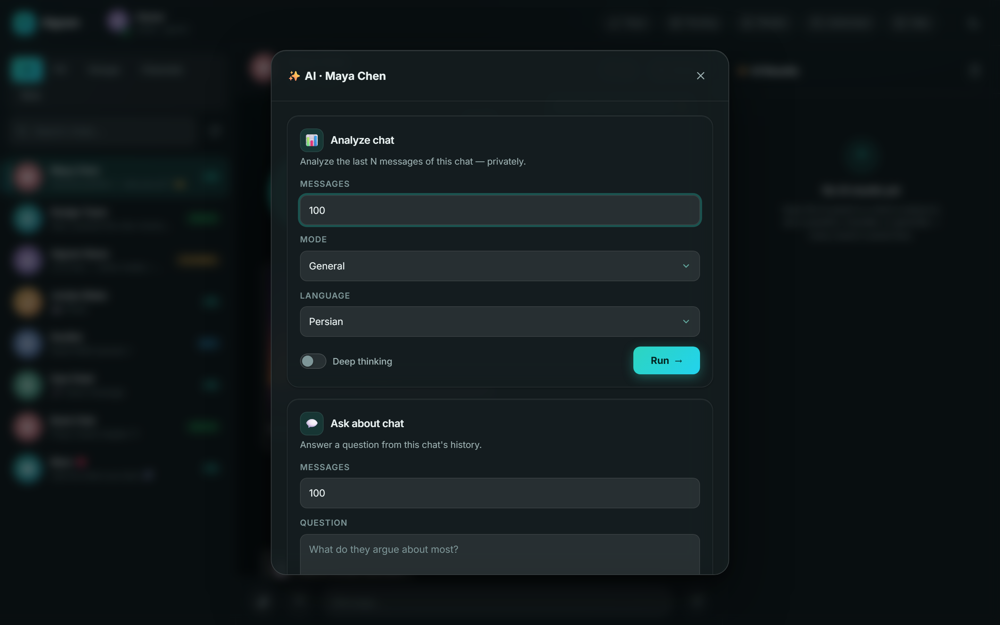<br/>
  <sub>The AI command sheet: analyze, ask, prompt, translate, image, speech</sub>
</td>
</tr>
<tr>
<td width="50%" align="center">
  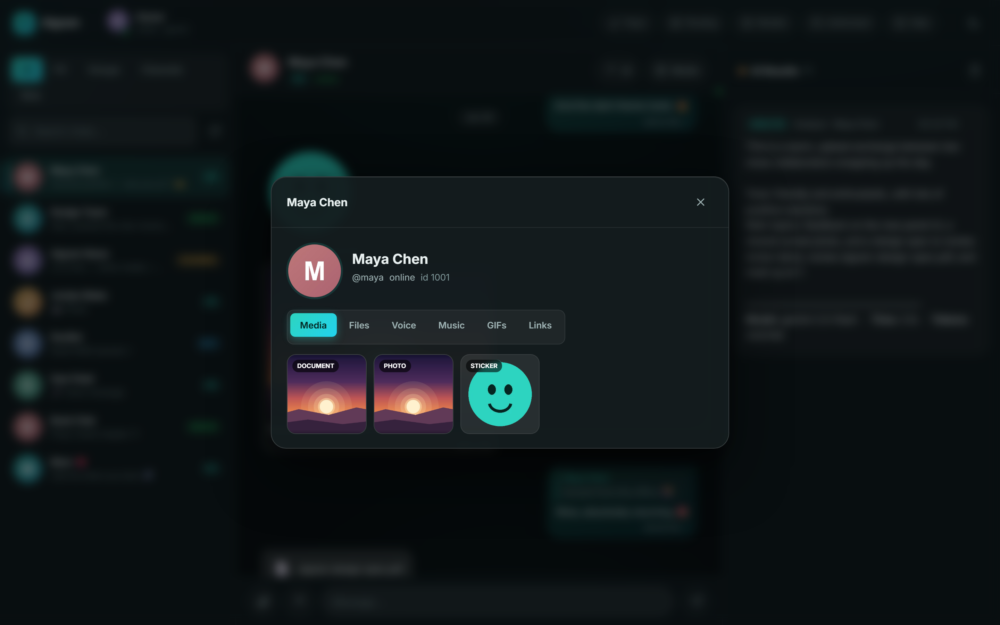<br/>
  <sub>Profile: avatar, username, presence, shared-media tabs</sub>
</td>
<td width="50%" align="center">
  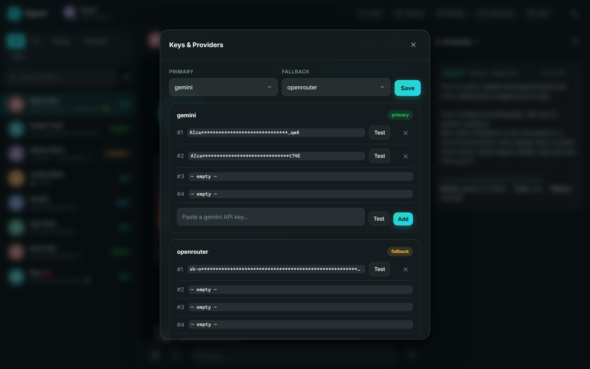<br/>
  <sub>Add, test, and switch provider keys without a restart</sub>
</td>
</tr>
</table>

</details>

<sub>All screenshots are generated from an invented demo account — fake contacts, fake messages, no real data ([regenerate them](#development)).</sub>

## Features

### Messaging

- Read and send text messages, with reply, edit, forward, and delete — the primary Telegram actions, from a per-message menu
- Attach files and images (button or drag-free clipboard paste) with a preview strip before sending
- Download any received file, copy message text, or copy an image straight to the clipboard
- Inline rendering of photos, animated stickers (Lottie `.tgs`), GIFs, video, voice notes, and documents
- Real Telegram profile photos as avatars, with colorful-initial fallbacks
- Profile view: open a chat's header for its avatar, username, bio, presence, and shared media
- Shared-media tabs: photos and videos, files, voice messages, music, GIFs, and links
- Grouped message bubbles, date separators, relative timestamps, and an "edited" marker
- Last-message previews in the chat list with type badges (PV, Group, Channel, Bot)
- Light and dark themes with a single-click toggle, responsive down to phone widths
- Self-hosted Inter and Vazirmatn fonts — no external network requests

### Live and real-time

- Live typing indicators, online/last-seen presence, and instant new messages over a Server-Sent-Events channel — no polling while it is connected, with an automatic polling fallback if it drops
- All of it rides Telegram's existing update stream, so the live channel makes no extra API calls

### AI inside the conversation

- Summarize the last N messages of a chat, with selectable tone and language
- Ask a question and have it answered from the chat's history
- Free-form prompting, with optional deep reasoning and web search
- Translation, including Persian phonetic output
- Image generation through Flux or SDXL workers
- Text-to-speech (Gemini TTS) and speech-to-text, with summaries of transcribed audio
- A persisted **AI Results history**: every result is saved with a category (Analyze, Ask, Translate, Prompt, Image, Voice, Transcribe), filterable by type, and text results survive a reload. On a phone the AI sheet opens full-screen and the result lands in a dedicated results drawer
- A visible amber note whenever a provider or model fallback was applied, so a quiet downgrade is never mistaken for lower-quality output

### Provider management

- Add, test, and rotate up to four API keys per provider with no restart
- Primary and fallback providers (Google Gemini and OpenRouter)
- Automatic key rotation on rate limits and quota errors
- Group-to-topic categorization and routing, authorized-user management, and a model matrix

### Hosting

- Runs on a small VPS, a home device, a Raspberry Pi, or Termux
- Installable as a Progressive Web App — "Add to Home Screen" on iOS/Android for a native-app experience
- Service worker caches the shell for instant repeat loads and an offline fallback page
- Disk media cache for avatars, thumbnails, and chat media to minimize Telegram API calls
- Request pacing and FloodWait handling to reduce the risk of an account limit

## Quick start

You need Python 3.10 or newer, [FFmpeg](https://ffmpeg.org/download.html) for the audio features, and Telegram API credentials from [my.telegram.org](https://my.telegram.org).

### With Docker

```bash
git clone https://github.com/Sina-Amare/Aigram.git aigram
cd aigram
docker compose up -d
docker compose exec sakaibot sakaibot setup    # Telegram login and LLM keys
docker compose exec sakaibot sakaibot panel    # prints the panel URL
```

### Without Docker

```bash
python -m venv venv
source venv/bin/activate        # Windows: venv\Scripts\activate
pip install -e .
sakaibot setup                  # first-run wizard: writes .env and logs you in
sakaibot panel                  # starts the control panel
```

The first run opens a setup wizard that collects your Telegram API id, hash, and phone number, handles the login code and two-factor step, and stores at least one LLM key. After that, `sakaibot panel` prints a URL of the form `http://127.0.0.1:8765/?token=…`. Open it, pick a chat, and you are in.

### Install it on your phone

The panel is a PWA. Serve it over HTTPS (a free Cloudflare Tunnel is the simplest option), open the URL on your phone, and use "Add to Home Screen". [DEPLOY.md](DEPLOY.md) covers the tunnel setup and a few hosting paths in detail.

## Configuration

The setup wizard writes these values for you. If you prefer to edit `.env` directly, this is the minimum:

```env
TELEGRAM_API_ID=12345678
TELEGRAM_API_HASH=your_api_hash
TELEGRAM_PHONE_NUMBER=+1234567890
LLM_PROVIDER=gemini
GEMINI_API_KEY_1=your_gemini_key
OPENROUTER_API_KEY_1=sk-or-v1-your-key   # fallback and image-prompt enhancement
```

Aigram uses Google Gemini as the primary provider and OpenRouter as the fallback. The defaults are pinned to the free-tier-friendly `gemini-2.5-flash` and `gemini-2.5-flash-lite`; the newer 3.x Flash models have small free quotas that rate-limit quickly. You can add and test keys from the Keys and Providers panel without editing files or restarting.

<details>
<summary>Additional configuration (key rotation, image workers, FFmpeg, model pins)</summary>

```env
# Up to four keys per provider, with automatic rotation on rate limits
GEMINI_API_KEY_1=key1
GEMINI_API_KEY_2=key2
OPENROUTER_API_KEY_1=key1

# Model pins (free-tier-friendly defaults shown)
GEMINI_MODEL_PRO=gemini-2.5-flash          # analyze, tellme, prompt
GEMINI_MODEL_FLASH=gemini-2.5-flash-lite   # translate, enhancement, summaries

# Image generation (Cloudflare Workers backend)
FLUX_WORKER_URL=https://your-flux-worker.workers.dev
SDXL_WORKER_URL=https://your-sdxl-worker.workers.dev
SDXL_API_KEY=your_bearer_token

# FFmpeg, auto-detected if it is on PATH
PATHS_FFMPEG_EXECUTABLE=/usr/bin/ffmpeg    # Windows: C:\ffmpeg\bin\ffmpeg.exe
```

</details>

## AI commands

These are available from the AI button inside any chat, where the result renders in the panel, or as slash commands typed directly in Telegram.

| Command | What it does | Options |
| --- | --- | --- |
| `/prompt=<text>` | Ask the model anything | `=think` for deep reasoning, `=web` for search |
| `/translate=<lang>=<text>` | Translate text, with Persian phonetics | source language is auto-detected |
| `/analyze=<N>` | Summarize the last N messages | `=fun`, `=romance`, `=general`, `=think` |
| `/tellme=<N>=<question>` | Answer a question from the last N messages | `=think`, `=web` |
| `/image=flux\|sdxl=<prompt>` | Generate an image (prompt is auto-enhanced) | rendered inline |
| `/tts=<text>` | Text-to-speech with Gemini voices | plays inline |
| `/stt` (as a reply to a voice note) | Transcribe and summarize the audio | — |

## Architecture

Aigram is a FastAPI application serving a vanilla-JavaScript PWA, with no build step. It runs on the same asyncio event loop as the Telethon client and shares a single MTProto session. The AI layer returns values rather than sending anything itself; the panel renders those values, and a single audited module (`messenger_service.py`) is the only place that writes to Telegram.

```text
src/
├── panel/                  # FastAPI app and the vanilla-JS PWA control panel
│   ├── app.py              # thin routes that delegate to services
│   ├── events.py           # in-process pub/sub fanning Telegram updates to SSE
│   ├── services/           # dialogs, entity (history/media/profile),
│   │                       #   messenger (send/edit/forward/delete), commands
│   │                       #   (AI), keys, groups, status, auth
│   ├── media_cache.py      # disk cache for avatars, thumbnails, and chat media
│   ├── avatars.py          # colorful SVG initials fallback (no external requests)
│   ├── throttle.py         # request pacing and FloodWait handling
│   └── static/             # index.html, app.css, app.js, sw.js, manifest, icons,
│                           #   self-hosted fonts (Inter + Vazirmatn), vendor/lottie
├── ai/                     # providers (Gemini/OpenRouter), TTS, STT,
│   │                       #   image generation, prompt enhancement, key rotation
├── telegram/               # Telethon integration, handlers, self-commands
├── cli/                    # Click CLI: panel, setup, monitor, config, group
└── core/                   # configuration (Pydantic), constants, exceptions
```

| Concern | Location | Purpose |
| --- | --- | --- |
| Shared MTProto session | `cli/utils.get_telegram_client` | one client, never a second connection |
| API key rotation | `ai/api_key_manager.py` | failover on rate limits and quota errors |
| Provider fallback | `ai/processor.py` | Gemini, then OpenRouter |
| Read pacing | `panel/throttle.py` | FloodWait handling on every Telegram read |
| Single write path | `panel/services/messenger_service.py` | the only module that sends, edits, forwards, or deletes |
| Live channel | `panel/events.py` + `panel/monitor_runtime.py` | SSE typing/presence/messages, RPC-free off the update stream |
| Hot reload | `panel/services/keys_service.py` | change keys and models without a restart |
| Media cache | `panel/media_cache.py` | avatars, thumbnails, and media cached to disk |
| Profile + presence | `panel/services/entity_service.py` | real photos, shared-media tabs, online status |

## Development

```bash
pip install -e ".[dev]"
ruff check .                              # lint
pytest                                    # default suite (live tests are skipped)
pytest tests/panel -q                     # panel and web tests
SAKAIBOT_RUN_LIVE_TESTS=1 pytest -m live  # real Telegram and real LLM, needs credentials
```

The CI workflow (`quality.yml`) byte-compiles the source, runs the test suite, and runs Ruff on every push. The live end-to-end tests drive a real Chromium through Playwright; they send only to your own Saved Messages, never to a third party.

To regenerate the README screenshots from the demo dataset:

```bash
pip install -e ".[dev]" && playwright install chromium
python tools/gen_screenshots.py
```

The generator renders the real panel against a mock Telegram client carrying invented contacts and a sample conversation, so the committed images never contain a real chat.

## Deployment

[DEPLOY.md](DEPLOY.md) covers running Aigram online, including from regions where Telegram or Google are blocked. It walks through a cheap VPS, a home device or Termux, and exposing the panel over a Cloudflare Tunnel for HTTPS and phone access.

## Contributing

Contributions are welcome. Please read [CONTRIBUTING.md](CONTRIBUTING.md) for the development setup, the code style (Black, Ruff, MyPy), and the [Conventional Commits](https://www.conventionalcommits.org/) format used in this repository. New features should come with tests, and CI needs to pass before a pull request is merged.

## Security and disclaimer

Aigram signs in as a real Telegram account, which makes it a userbot. This is against Telegram's Terms of Service and can lead to your account being limited or banned. Use an account you are willing to risk, run from a stable IP, avoid bulk or automated sending, and keep your access token private. You host your own instance, and no one else holds your session.

## License

Released under the MIT License. See [LICENSE](LICENSE). Copyright (c) 2025–2026 Sina Amare.

Built with [Telethon](https://github.com/LonamiWebs/Telethon), [Google Gemini](https://ai.google.dev/), [OpenRouter](https://openrouter.ai/), [FastAPI](https://fastapi.tiangolo.com/), [Click](https://click.palletsprojects.com/), [Pydantic](https://pydantic.dev/), and [lottie-web](https://github.com/airbnb/lottie-web) for animated stickers.
